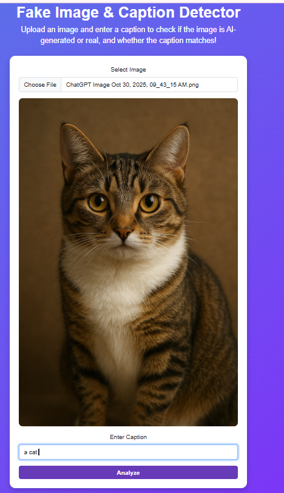
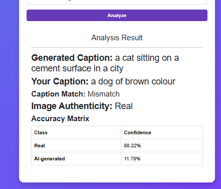

# Real-vs-AI-Generated-Image-Detector-With-Caption-Verification

This repository contains a web-based application that can:

1. **Detect whether an image is Real or AI-generated**
2. **Generate an image caption using BLIP**
3. **Check whether the user-provided caption matches the image using CLIP**
4. **Display confidence scores in an Accuracy Matrix**

---

## Project Overview

AI-generated images are becoming increasingly realistic.  
At the same time, captions attached to images online may be misleading.

This project solves two major problems:

### **1. Fake Image Detection**
A fine-tuned **ResNet18** model classifies images into:
- **Real**
- **AI-generated**

### **2. Caption Verification**
The system uses:
- **BLIP** → Auto-generates a caption describing the image  
- **CLIP** → Compares user caption with image meaning  

**Output:**
- **Match** → User caption matches generated caption  
- **Mismatch** → User caption does not match the generated caption  

---

##  How the System Works

### **Step 1 — User Upload**
User uploads an image and caption through the Flask web interface.

### **Step 2 — Image Preprocessing**
- Convert to **RGB**
- Fix **EXIF orientation**
- Resize to **224×224**
- Normalize using **ImageNet statistics**

### **Step 3 — Fake Image Detection (ResNet18)**
- Pretrained on **ImageNet**
- Final FC layer modified to **2 classes (Real / AI)**
- Softmax generates probability scores  
- Output displayed as **Accuracy Matrix**

### **Step 4 — Caption Generation (BLIP)**
- Model used: `Salesforce/blip-image-captioning-base`
- Produces a natural-language caption describing the uploaded image

### **Step 5 — Caption–Image Matching (CLIP)**
CLIP:
- Converts user caption + image into embeddings
- Computes **Cosine Similarity**
- Determines **Match / Mismatch**

### **Step 6 — Final Output**
The system displays:
- **Real / AI-generated**
- **Confidence scores**
- **Generated caption**
- **User caption**
- **Caption Match / Mismatch**

---

##  Technologies Used

### **Backend**
- Python  
- Flask  

### **Deep Learning**
- PyTorch  
- Torchvision  
- BLIP (Caption generation)  
- CLIP (Caption–image similarity)  
- ResNet18 (Fake image classifier)

### **Utilities**
- Pillow (Image loading)
- NumPy (Numeric operations)

### **Platform**
- VSCode  

---

## Installation & Running

### **1. Install Dependencies**
- pip install -r requirements.txt
### **2. Run the Flask app**
-python app.py
 ### **3. Open in browser**
- http://127.0.0.1:5000/

Output and GUI
## Output and GUI

Team Members
•	Samriddhi Sharma (252IT024)
•	Sakshi Vispute (252IT032)

